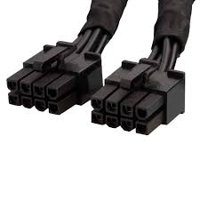

# EPS 4/8 Pines

**Descripción breve:** 
Proporcionan una fuente estable de corriente al procesador
**Pines/Carriles/Voltajes/Velocidad:** 
**Numero de pines:**4 y 8 pines
**Voltajes**+12V
**Uso principal:** 
Alimentar el procesador de manera directa
**Compatibilidad actual:** Alta 

## Identificación física
Los conectores EPS de 4 y 8 pines se conectan a la placa base cerca del socket de la CPU. suelen ser negros y los mas antiguos blancos

## Notas técnicas
El conector de 8 pines es un conector normalmente usado en sistemas de gama alta

## Fotos
**EPS de 4 pines**

**EPS de 8 pines**

## Fuentes
[Apuntes](https://fhw.rubenvalentin.com/00---Unidades-de-Trabajo/UT2/Contenido/UT2---Elementos-internos-de-un-sistema-inform%C3%A1tico#conector-eps-de-4-y-8-pines)
