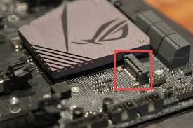

# M.2 (NVMe/SATA)

**Descripción breve:** 
Conector interno de alta velocidad para dispositivos de almacenamiento y expansión.

**Numero de pines:**hasta 67 pines
**tipos:**
- SATA: hasta 600 MB/s

- NVMe PCIe 3.0 x4: hasta 3.5 GB/s

- NVMe PCIe 4.0 x4: hasta 7 GB/s

- NVMe PCIe 5.0 x4: hasta 14 GB/s
**Uso principal:** 
Conectar modulos de expansión
**Compatibilidad actual:** Alta

## Identificación física
La ranura M.2 es la que esta horizontal a la placa y que parece como si fuera un slot para tarjetas y las ranuras NVME son horizontales.

## Notas técnicas
Los SATA no funcionan en ranuras M.2 solo en NVME

## Fotos

## Fuentes
- [CHATGPT](https://chatgpt.com/)
- [NVME](https://nvmexpress.org/wp-content/uploads/NVMe-NVM-Express-2.0a-2021.07.26-Ratified.pdf)
- [SATA](https://sata-io.org/system/files/specifications/SerialATA_Revision_3_5_Gold.pdf)

[def]: ../../../assets/img/11-conectores_datos/m.2.jpg