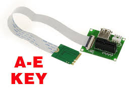

# M.2 KEY A-E

**Descripción breve:** 
Slot de uso principal wifi/Bluetooth

**Pines/Carriles/Voltajes/Velocidad:** 

- pines:24-31 

**Uso principal:** <texto> 
Es un slot que se esa usando sobretodo en portatiles para Wifi y bluetooth por su reducido tamaño

**Compatibilidad actual:** Alta 

## Identificación física
-16 mm de ancho y 30 mm de largo

## Notas técnicas
color: normalmente negro

## Fotos

## Fuentes
[DELL](https://www.dell.com/support/kbdoc/es-es/000144170/diferencias-entre-las-tarjetas-m2-las-ranuras-m2-los-tama%C3%B1os-y-los-tipos-de-teclas)

