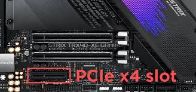

# PCIe x4>

**Descripción breve:**  
Tarjetas de expansión de alto rendimiento

**Pines/Carriles/Voltajes/Velocidad:** 
- PCIe x4 es de 4 líneas y tiene  21 pines

- Velocidades máximas por generación:

- PCI-e 1. → ≈1000MB/s

- PCI-e 2.x → ≈ 2000MB/s

- PCIe 3.0: → ≈ 3940MB/s

- PCIe 4.0: → ≈ 7876MB/s

**Uso principal:**
Tarjetas de expansión de alto rendimiento como controladoras NVMe, adaptadores de red de 10 GbE o más

**Compatibilidad actual:** Alta 

## Identificación física
- slot vertical de 39 mm

## Notas técnicas
Las tarjetas x4 tienen compatibilidad con los slots x8, x16

## Fotos

## Fuentes
[ProfesionalReview](https://www.profesionalreview.com/2018/12/10/conectores-pci-express-x16-x8-x4-y-x1/)
[Hardzone](https://hardzone.es/tutoriales/rendimiento/velocidad-pci-express-pcie/)

