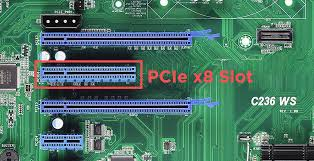

# PCIe x8>

**Descripción breve:**  
Ranura de expansión de alto rendimiento con ocho carriles PCI Express.

**Pines/Carriles/Voltajes/Velocidad:**
 
-  8 líneas y tiene 46 pines

- Velocidades máximas por generación:

- PCI-e 1. → ≈ 2000MB/s

- PCI-e 2.x → ≈ 4000MB/s

- PCIe 3.0: → ≈ 7880MB/s

- PCIe 4.0: → ≈ 15752MB/s

**Uso principal:**
Tarjetas de red profesionales, aceleradores de IA, controladoras SAS, o tarjetas gráficas secundarias.

**Compatibilidad actual:** Alta 

## Identificación física
- slot vertical de 56 mm

## Notas técnicas
Las tarjetas x8 tiene compatibilidad con el slot x16

## Fotos

## Fuentes
[ProfesionalReview](https://www.profesionalreview.com/2018/12/10/conectores-pci-express-x16-x8-x4-y-x1/)
[Hardzone](https://hardzone.es/tutoriales/rendimiento/velocidad-pci-express-pcie/)

