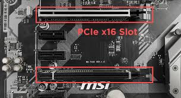

# Slot: PCI Express x16 (Gen4/Gen5)

**Descripción breve:** Ranura de expansión de altas prestaciones usada para GPUs/aceleradoras.  
**Pines/Carriles/Voltajes/Velocidad:** x16 carriles · Gen4 16 GT/s · Gen5 32 GT/s  
**Uso principal:** Tarjetas gráficas; también aceleradoras y NVMe en adaptador  
**Compatibilidad actual:** Alta

## Identificación física
- Ranura larga con pestaña; color variable por fabricante.

## Notas técnicas
- Ancho de banda efectivo depende de generación y carriles disponibles (CPU/Chipset).

## Fotos

## Fuentes
- https://pcisig.com/
