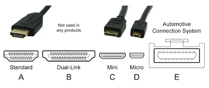

HDMI 2.1

**Descripción breve:**
penultima version de HDM, 

**Pines/Carriles/Voltajes/Velocidad:** 
Tipo A: 19 pines, 13.9×4.45 mm, 4K.

Tipo B: NO SE USA

Tipo C (Mini): 19 pines, 10.42×2.42 mm, portátiles.

Tipo D (Micro): 19 pines, 5.83×2.20 mm, compacto.

Tipo E: Pestaña de bloqueo, protección contra humedad y suciedad.
**Uso principal:** 
Transmisión de video y audio digital en alta resolución y frecuencia, compatible con 4K, 8K y 10K.

**Compatibilidad actual:** Alta | 

## Identificación física
Es un rectangulo sin esquinas normalmente de colo negro.

## Notas técnicas
Retrocompatible con versiones HDMI anteriores

## Fotos

## Fuentes
[Wikipedia][https://es.wikipedia.org/wiki/High-Definition_Multimedia_Interface]
