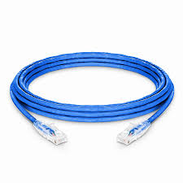
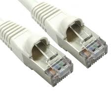
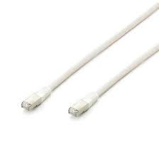

# Rj45 1G / 2.5G / 10G

**Descripción breve:**
El conector RJ-45 es un estándar para conexiones de red cableadas (Ethernet).

**Pines/Carriles/Voltajes/Velocidad:** <datos clave>  
- Pines: 8
- pares trenzado: 4
- Voltaje 2,5 V max
- Velocidad: 1 Gb/s (Gigabit), 2.5 Gb/s, hasta 10 Gb/s

**Uso principal:** <texto>  
 Se usa en computadoras, enrutadores, switches y otros dispositivos de red para conexiones confiables y rápidas.
**Compatibilidad actual:** Alta

## Identificación física
Los cables pueden ser azul, gris, amarillo, etc.; el conector suele ser transparente (se ven los hilos internos).

## Notas técnicas
**1G (Gigabit Ethernet):**

Estándar IEEE 802.3ab (1000Base-T)

Usa los 4 pares del cable

 Cat 5e o superior

**2.5G (2.5GBase-T):**

Estándar IEEE 802.3bz

Compatible con cables Cat 5e o Cat 6 hasta 100 m

**10G (10GBase-T):**

Estándar IEEE 802.3an

Requiere Cat 6A o superior para alcanzar 100 m

Soporta PoE/PoE+ y transmisión full-duplex

## Fotos
**CAT 5e**

**CAT 6**

**CAT 6A**

## Fuentes
[chatGPT](https://chatgpt.com/)
[Apuntes](https://fhw.rubenvalentin.com/00---Unidades-de-Trabajo/UT2/Contenido/UT2---Elementos-internos-de-un-sistema-inform%C3%A1tico-PARTE-I)