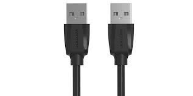

# USB-A

**Descripción breve:**
Conector USB estándar rectangular utilizado para conectar periféricos como teclados, ratones, memorias y otros dispositivos a ordenadores.

**Pines/Carriles/Voltajes/Velocidad:** <datos clave>  
Pines: 4  USB 3.0: 9
voltaje: 5V
Velocidad:
USB 2.0: hasta 480 Mb/s
USB 3.0: 5 Gb/s

**Uso principal:** <texto>  
Conectar dispositivos usb
**Compatibilidad actual:** Alta
Forma rectangular y plana
## Identificación física
Es un rectangulo de 12 mm de ancho y 4,5 mm de alto

## Notas técnicas
El diseño esta diseñado para no provocar sobrecargas electricas.

## Fotos

## Fuentes
[Wikipedia](https://es.wikipedia.org/wiki/Universal_Serial_Bus)
