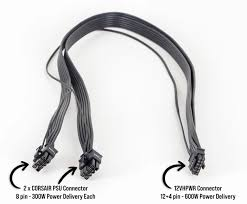
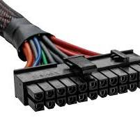
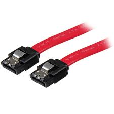
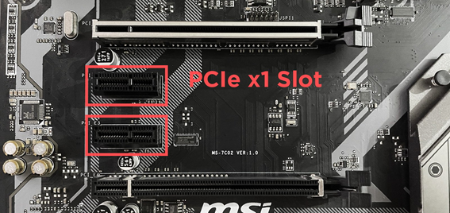
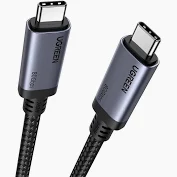

# ENTREGA ÚNICA - Reto 01

> Exporta este archivo como **PDF único** con nombre:  
> `apellido1_apellido2_nombre_FHW01_Tarea`  *(sin ñ ni tildes)*

## Índice

- [Portada](#portada)
- [1. Introducción](#1-introduccion)
- [2. Conectores internos (energía)](#2-conectores-internos-energia)
- [3. Conectores de datos](#3-conectores-de-datos)
- [4. Slots de expansión](#4-slots-de-expansion)
- [5. Conectores externos](#5-conectores-externos)

## Portada

**Módulo:** Fundamentos de Hardware (ASIR)  
**Alumno/a:** _Yllán Cazorla Más_  
**Curso:** 2025/26

## 1. Introducción
Piensa el PC como una **ciudad**:  
- **Conectores** = **carreteras y puentes** (energía y datos).  
- **Slots** = **parcelas** para ampliar (tarjetas).

Objetivo del reto: **identificar** y **explicar** conectores/slots **actuales**.

## 2. Conectores internos (energía)

### 12VHPWR/12V-2x6.

**Descripción breve:** 
Con la creacion de la RTX 40 se creo un nuevo estandar llamado 12V-2x6 por eso sacaron una nueva version del conector 12VHPWR usando el nuevo estandar.
**Pines/Carriles/Voltajes/Velocidad:** 
**Numero de pines:**12+4 PINES
**Voltajes**:hasta 600W 

**Uso principal:** <texto>
Alimentar la GPU

**Compatibilidad actual:** Alta 

#### Identificación física
Cable grande de color negro tiene de 12 a 16 pines

#### Notas técnicas
En comparación con el conector 12VHPWR original, el nuevo conector 12V-2x6 tiene clavijas de detección ligeramente más cortas (0,25 mm), mientras que los terminales conductores son 1,5 mm más largos.

#### Fotos

#### Fuentes
[CORSAIR](https://www.corsair.com/es/es/explorer/diy-builder/power-supply-units/evolving-standards-12vhpwr-and-12v-2x6/?srsltid=AfmBOor6FPgj9Qgm-R-PABZIxRhBBRUhUi4_R2GOes09LfFHjY8Y4q0I)

### Conector: ATX de 24 pines

**Descripción breve:** Conector principal que alimenta la placa base en sistemas ATX/ATX12V.  
**Pines/Carriles/Voltajes/Velocidad:** 24 pines · +3.3V, +5V, +12V  
**Uso principal:** Alimentación de la placa base  
**Compatibilidad actual:** Alta

#### Identificación física
- Bloque rectangular de 24 pines con clip, situado en el borde de la placa base.

#### Notas técnicas
- Estándar ATX12V 2.x. No confundir con el EPS de CPU (4/8 pines).

#### Fotos

### EPS 4/8 Pines

**Descripción breve:** 
Proporcionan una fuente estable de corriente al procesador
**Pines/Carriles/Voltajes/Velocidad:** 
**Numero de pines:**4 y 8 pines
**Voltajes**+12V
**Uso principal:** 
Alimentar el procesador de manera directa
**Compatibilidad actual:** Alta 

#### Identificación física
Los conectores EPS de 4 y 8 pines se conectan a la placa base cerca del socket de la CPU. suelen ser negros y los mas antiguos blancos

#### Notas técnicas
El conector de 8 pines es un conector normalmente usado en sistemas de gama alta

#### Fotos
**EPS de 4 pines**

**EPS de 8 pines**

## Fuentes
[Apuntes](https://fhw.rubenvalentin.com/00---Unidades-de-Trabajo/UT2/Contenido/UT2---Elementos-internos-de-un-sistema-inform%C3%A1tico#conector-eps-de-4-y-8-pines)

### Sata Alimentación 15 pines

**Descripción breve:** 
Es un conector que sirve para suministrar energia a los dispositivos de almacenamiento.
**Pines/Carriles/Voltajes/Velocidad:** 
**Numero de pines:** 15 pines
**Voltajes:**+3.3V, +5V, +12V

**Uso principal:**
Suministrar energia a los dispositivos de almacenamiento desde la fuente
**Compatibilidad actual:** Alta 

#### Identificación física
Conector plano con forma de L suelen ser negros 

#### Notas técnicas
- Sustituye a los antiguos conectores Molex de 4 pines.

#### Fotos

#### Fuentes
[IBERICAVIP](https://ibericavip.com/blog/pc-workstation/guia-para-principiantes-sobre-cables-sata-todo-lo-que-necesitas-saber/?srsltid=)
[Apuntes](https://fhw.rubenvalentin.com/00---Unidades-de-Trabajo/UT2/Contenido/UT2---Elementos-internos-de-un-sistema-inform%C3%A1tico)

## 3. Conectores de datos

### conector: SATA Datos 7 pines

**Descripción breve:** <2–3 líneas>
No es un cable de alimentacion si no de datos sirve para transferir datos se conecta a dispositivos de almacenamiento.
**Pines/Carriles/Voltajes/Velocidad:** <datos clave>
**Numero de pines:** 7 pines
**tipos:**
- SATA I: 1.5 Gb/s

- SATA II: 3.0 Gb/s

- SATA III: 6.0 Gb/s
**Uso principal:** <texto>
Conexión de datos entre el dispositivo de almacenamiento y la placa base
**Compatibilidad actual:** Alta

#### Identificación física
Tiene una forma muy distintiva es un slot vacio que tiene en el centro una L, su color suele variar entre tres colores(rojo, azul y negro)

#### Notas técnicas
- Retrocompatible entre versiones
- Al ser un conector para datos no transmite energia

#### Fotos
##### Slot

##### Conector

## Fuentes
https://ibericavip.com/blog/pc-workstation/guia-para-principiantes-sobre-cables-sata-todo-lo-que-necesitas-saber/?srsltid=AfmBOoqVx1ded05Q4N7QLSXT3ATPyg_hTAiV87QdqdG0JQpx1Lu2WuFb

### M.2 (NVMe/SATA)

**Descripción breve:** 
Conector interno de alta velocidad para dispositivos de almacenamiento y expansión.

**Numero de pines:**hasta 67 pines
**tipos:**
- SATA: hasta 600 MB/s

- NVMe PCIe 3.0 x4: hasta 3.5 GB/s

- NVMe PCIe 4.0 x4: hasta 7 GB/s

- NVMe PCIe 5.0 x4: hasta 14 GB/s
**Uso principal:** 
Conectar modulos de expansión
**Compatibilidad actual:** Alta

#### Identificación física
La ranura M.2 es la que esta horizontal a la placa y que parece como si fuera un slot para tarjetas y las ranuras NVME son horizontales.

#### Notas técnicas
Los SATA no funcionan en ranuras M.2 solo en NVME

#### Fotos

#### Fuentes
- [CHATGPT](https://chatgpt.com/)
- [NVME](https://nvmexpress.org/wp-content/uploads/NVMe-NVM-Express-2.0a-2021.07.26-Ratified.pdf)
- [SATA](https://sata-io.org/system/files/specifications/SerialATA_Revision_3_5_Gold.pdf)

[def]: ../../../assets/img/11-conectores_datos/m.2.jpg

## 4. Slots de expansión

### M.2 KEY A-E

**Descripción breve:** 
Slot de uso principal wifi/Bluetooth

**Pines/Carriles/Voltajes/Velocidad:** 

- pines:24-31 

**Uso principal:** <texto> 
Es un slot que se esa usando sobretodo en portatiles para Wifi y bluetooth por su reducido tamaño

**Compatibilidad actual:** Alta 

#### Identificación física
-16 mm de ancho y 30 mm de largo

#### Notas técnicas
color: normalmente negro

#### Fotos

#### Fuentes
[DELL](https://www.dell.com/support/kbdoc/es-es/000144170/diferencias-entre-las-tarjetas-m2-las-ranuras-m2-los-tama%C3%B1os-y-los-tipos-de-teclas)

### PCIe x1

**Descripción breve:**
Ranura de expansion para tarjetas de expansion simples

**Pines/Carriles/Voltajes/Velocidad:** <datos clave>
- PCIe x1 es de 1 línea y tiene 18 pines

- Voltajes: 3.3 V y 12 V

- Velocidades máximas por generación:
- PCI-e 1. → ≈250MB/s

- PCI-e 2.x → ≈ 500MB/s

- PCIe 3.0: → ≈ 985MB/s

- PCIe 4.0: → ≈1969MB/s

**Uso principal:** <texto>  
Tarjetas de expansion simples como : Tarjeta de expansion para wifi, USB,etc

**Compatibilidad actual:** Alta

#### Identificación física
- slot vertical de 25mm 

#### Notas técnicas
Las tarjetas x1 tienen compatibilidad con los demas slots x4 x8 x16

#### Fotos

#### Fuentes
[ProfesionalReview](https://www.profesionalreview.com/2018/12/10/conectores-pci-express-x16-x8-x4-y-x1/)
[Hardzone](https://hardzone.es/tutoriales/rendimiento/velocidad-pci-express-pcie/)

### PCIe x4>

**Descripción breve:**  
Tarjetas de expansión de alto rendimiento

**Pines/Carriles/Voltajes/Velocidad:** 
- PCIe x4 es de 4 líneas y tiene  21 pines

- Velocidades máximas por generación:

- PCI-e 1. → ≈1000MB/s

- PCI-e 2.x → ≈ 2000MB/s

- PCIe 3.0: → ≈ 3940MB/s

- PCIe 4.0: → ≈ 7876MB/s

**Uso principal:**
Tarjetas de expansión de alto rendimiento como controladoras NVMe, adaptadores de red de 10 GbE o más

**Compatibilidad actual:** Alta 

#### Identificación física
- slot vertical de 39 mm

#### Notas técnicas
Las tarjetas x4 tienen compatibilidad con los slots x8, x16

#### Fotos

#### Fuentes
[ProfesionalReview](https://www.profesionalreview.com/2018/12/10/conectores-pci-express-x16-x8-x4-y-x1/)
[Hardzone](https://hardzone.es/tutoriales/rendimiento/velocidad-pci-express-pcie/)

### PCIe x8>

**Descripción breve:**  
Ranura de expansión de alto rendimiento con ocho carriles PCI Express.

**Pines/Carriles/Voltajes/Velocidad:**
 
-  8 líneas y tiene 46 pines

- Velocidades máximas por generación:

- PCI-e 1. → ≈ 2000MB/s

- PCI-e 2.x → ≈ 4000MB/s

- PCIe 3.0: → ≈ 7880MB/s

- PCIe 4.0: → ≈ 15752MB/s

**Uso principal:**
Tarjetas de red profesionales, aceleradores de IA, controladoras SAS, o tarjetas gráficas secundarias.

**Compatibilidad actual:** Alta 

#### Identificación física
- slot vertical de 56 mm

#### Notas técnicas
Las tarjetas x8 tiene compatibilidad con el slot x16

#### Fotos

#### Fuentes
[ProfesionalReview](https://www.profesionalreview.com/2018/12/10/conectores-pci-express-x16-x8-x4-y-x1/)
[Hardzone](https://hardzone.es/tutoriales/rendimiento/velocidad-pci-express-pcie/)

### PCIe x16>

**Descripción breve:**  
Ranura de expansión principal de alta velocidad que requieren el máximo ancho de banda disponible en la interfaz PCI Express.
**Pines/Carriles/Voltajes/Velocidad:**
 
-  16 líneas y tiene 46 pines

- Velocidades máximas por generación:

- PCI-e 1. → ≈ 4000MB/s

- PCI-e 2.x → ≈ 8000MB/s

- PCIe 3.0: → ≈ 15760MB/s

- PCIe 4.0: → ≈ 31504MB/s

**Uso principal:**
Ranura de expansión principal de alta velocidad utilizada principalmente para tarjetas gráficas (GPU), aceleradores de IA, y tarjetas de expansión profesionales.

**Compatibilidad actual:** Alta 

#### Identificación física
- slot vertical de 89 mm

#### Notas técnicas
No tiene compatibilidad  con ningun slot anterior

## Fotos

#### Fuentes
[ProfesionalReview](https://www.profesionalreview.com/2018/12/10/conectores-pci-express-x16-x8-x4-y-x1/)
[Hardzone](https://hardzone.es/tutoriales/rendimiento/velocidad-pci-express-pcie/)

## 5. Conectores externos
### DisplayPort 1.4 y 2.0

**Descripción breve:**
Es una interfaz de pantalla que sirve para transportar la señal de la pantalla

**Pines/Carriles/Voltajes/Velocidad:** 
- Pines: 20
- Lineas: 1-4
- Velocidad: 
-1.4:  25,79 Gb/s
-2.0:  77,37 Gb/s

**Uso principal:** 
Transmisión de video y audio de alta definición, soportando monitores 4K, 8K y configuraciones múltiples.
**Compatibilidad actual:** Alta | 

#### Identificación física
Suelen ser negros tienen una forma cuadrada pero que le falta una esquina 

#### Notas tecnicas

**DisplayPort 1.4:**

- Resolución máxima: 8K@60 Hz con DSC o 4K@120 Hz
- Soporta HDR10, DSC 1.2a y Adaptive Sync

**DisplayPort 2.0**

- Resolución máxima: 16K@60 Hz o 3×4K@90 Hz
- Soporta HDR dinámico, mayor eficiencia energética y VRR
- Compatible con versiones anteriores

#### Fotos
**DisplayPort 1.4:**

**DisplayPort 2.0:**

#### Fuentes
[ibericavip](https://ibericavip.com/blog/pc-workstation/displayport-1-4a-vs-2-0-2-1-en-la-tarjeta-grafica-por-que-es-importante/?srsltid=AfmBOopepPM0VMMIXtYv4PNPo5i_5lOhxMNsSc6qKnSzm9Shja8Nrj82)
[Wikipedia](https://es.wikipedia.org/wiki/DisplayPort)

### USB-C (USB4/PD)

**Descripción breve:** Conector reversible para datos, vídeo y alimentación (PD).

**Pines/Carriles/Voltajes/Velocidad:** 24 pines · USB4 hasta 40 Gbps · PD hasta 100–240 W (según perfil)  

**Uso principal:** Carga y conexión de periféricos/monitores/docks  

**Compatibilidad actual:** Alta (ojo: no todo USB-C soporta TB/PD)

#### Identificación física
- Ovalado y simétrico; símbolos: rayo (Thunderbolt), “SS” (SuperSpeed).

#### Notas técnicas
- Requisitos de cable para 40 Gbps/240 W; DP Alt Mode para vídeo si no es TB.

#### Fotos

## Fuentes
- [USB](https://usb.org/)

### HDMI 2.1

**Descripción breve:**
penultima version de HDM, 

**Pines/Carriles/Voltajes/Velocidad:** 
Tipo A: 19 pines, 13.9×4.45 mm, 4K.

Tipo B: NO SE USA

Tipo C (Mini): 19 pines, 10.42×2.42 mm, portátiles.

Tipo D (Micro): 19 pines, 5.83×2.20 mm, compacto.

Tipo E: Pestaña de bloqueo, protección contra humedad y suciedad.
**Uso principal:** 
Transmisión de video y audio digital en alta resolución y frecuencia, compatible con 4K, 8K y 10K.

**Compatibilidad actual:** Alta | 

#### Identificación física
Es un rectangulo sin esquinas normalmente de colo negro.

#### Notas técnicas
Retrocompatible con versiones HDMI anteriores

#### Fotos

#### Fuentes
[Wikipedia][https://es.wikipedia.org/wiki/High-Definition_Multimedia_Interface]

### Rj45 1G / 2.5G / 10G

**Descripción breve:**
El conector RJ-45 es un estándar para conexiones de red cableadas (Ethernet).

**Pines/Carriles/Voltajes/Velocidad:** <datos clave>  
- Pines: 8
- pares trenzado: 4
- Voltaje 2,5 V max
- Velocidad: 1 Gb/s (Gigabit), 2.5 Gb/s, hasta 10 Gb/s

**Uso principal:** <texto>  
 Se usa en computadoras, enrutadores, switches y otros dispositivos de red para conexiones confiables y rápidas.
**Compatibilidad actual:** Alta

#### Identificación física
Los cables pueden ser azul, gris, amarillo, etc.; el conector suele ser transparente (se ven los hilos internos).

#### Notas técnicas
**1G (Gigabit Ethernet):**

Estándar IEEE 802.3ab (1000Base-T)

Usa los 4 pares del cable

 Cat 5e o superior

**2.5G (2.5GBase-T):**

Estándar IEEE 802.3bz

Compatible con cables Cat 5e o Cat 6 hasta 100 m

**10G (10GBase-T):**

Estándar IEEE 802.3an

Requiere Cat 6A o superior para alcanzar 100 m

Soporta PoE/PoE+ y transmisión full-duplex

#### Fotos
**CAT 5e**

**CAT 6**

**CAT 6A**

#### Fuentes
[chatGPT](https://chatgpt.com/)
[Apuntes](https://fhw.rubenvalentin.com/00---Unidades-de-Trabajo/UT2/Contenido/UT2---Elementos-internos-de-un-sistema-inform%C3%A1tico-PARTE-I)

### USB-A

**Descripción breve:**
Conector USB estándar rectangular utilizado para conectar periféricos como teclados, ratones, memorias y otros dispositivos a ordenadores.

**Pines/Carriles/Voltajes/Velocidad:** <datos clave>  
Pines: 4  USB 3.0: 9
voltaje: 5V
Velocidad:
USB 2.0: hasta 480 Mb/s
USB 3.0: 5 Gb/s

**Uso principal:** <texto>  
Conectar dispositivos usb
**Compatibilidad actual:** Alta
Forma rectangular y plana
#### Identificación física
Es un rectangulo de 12 mm de ancho y 4,5 mm de alto

#### Notas técnicas
El diseño esta diseñado para no provocar sobrecargas electricas.

#### Fotos

#### Fuentes
[Wikipedia](https://es.wikipedia.org/wiki/Universal_Serial_Bus)
