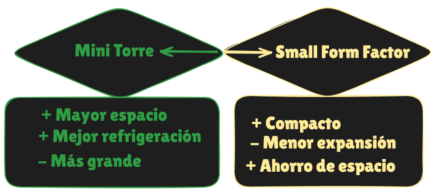

# Formatos de chasis: diagrama y análisis

**Formatos elegidos:** 

## Diagrama

## Impacto del tamaño
 **Capacidad de componentes:** 
  - **Mini Torre:** 
  Tiene espacio para instalar componentes 
  - **Small Form Factor:**
  Totalmente llimitado no se suele poder instalar componentes al ser diseños compactos
 **Refrigeración:** 
- **Mini Torre:** 
Flujo de aire limitado

- **Small Form Factor:**
Escasa menos espacio para ventilacion.
### **Uso típico:** 
- **Mini Torre:**
 estaciones de trabajo .

- **Small Form Factor:** Oficinas, aulas o entornos donde se prioriza el tamaño compacto y bajo consumo frente a la potencia. 
