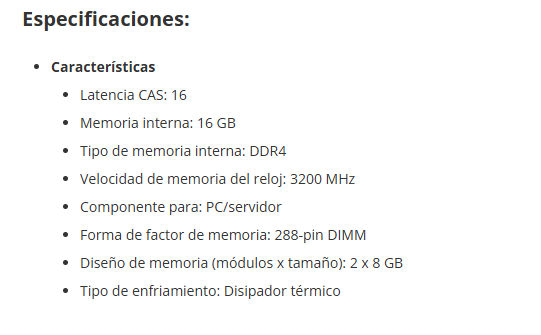
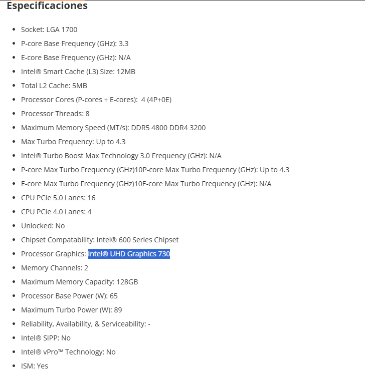
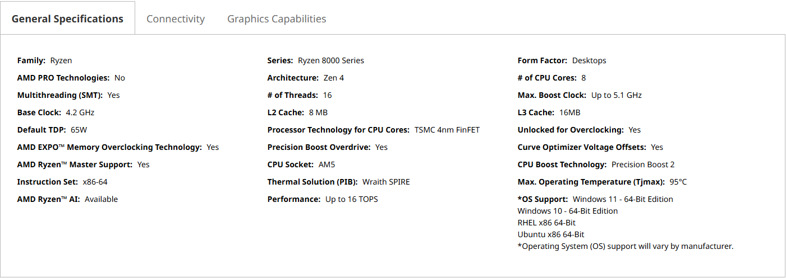

# Parte 2 — Componentes y DDR5 (archivo único)

## 1) Búsqueda de componentes

Para cada uno: **marca/modelo**, **características**, **precio**, **URL**, **captura**, **justificación**.

### RAM oficina

- Marca/Modelo:
- Capacidad/Velocidad/Tipo:16GB (2x8GB) / 3200MHz / DDR4 /
- Precio:105,93€
- URL:[PCcomponentes](https://www.pccomponentes.com/corsair-vengeance-lpx-ddr4-3200-pc4-25600-16gb-2x8gb-cl16-negro)
- Captura:
- Justificación:Maldita IA esta carisima la RAM,buena velocidad y capacidad precio alto pero ahora mismo es un precio normal comparando los precios actuales. 16Gb es el nuevo estandar

### RAM gaming

- Marca/Modelo:Memoria RAM Corsair Vengeance RGB DDR5
- Capacidad/Velocidad/Tipo:32GB (2x16GB) / 6000MHz / DDR5
- Precio:479,95€
- URL::[PCcomponentes](https://www.pccomponentes.com/corsair-vengeance-rgb-ddr5-6000mhz-32-gb-2x16gb-cl36-memoria-dual-amd-expo-e-intel-xmp)
- Captura:
- Justificación:En gaming se necesita ir a la maxima potencia posible y ahora con los avances en videojuegos el estandar es 16GB pero se esta empezando a necesitar hasta  32GB no dudo que dentro de poco sea el nuevo estandar en gaming . Y con luces para mas personalizacion

### CPU oficina

- Marca/Modelo:Intel Core i3-12100
- Núcleos/Hilos/Frecuencia:4 Núcleos / 8 Hilos / 3.3 GHz
- TDP/Gráfica integrada (si aplica):60W / gradicos integrados: Intel® UHD Graphics 730
- Precio:154,90€
- URL:[PCcomponentes](https://www.pccomponentes.com/intel-core-i3-12100-33-ghz)
- Captura:
- Justificación:Procesador intel con 4 nucleos potencia suficiente para aplicaciones de ofimatica y  tambien tiene graficos integrados

### CPU gaming

- Marca/Modelo:AMD Ryzen™ 7 8700G Processor
- Núcleos/Hilos/Frecuencia:8 Núcleos / 16 Hilos / 4.2 GHz
- TDP:65W añade graficos: AMD Radeon 780M
- Precio:288.00€
- URL:[AMD](https://shop-eu-en.amd.com/amd-ryzen-7-8700G-processor/)
- Captura:
- Justificación:No es un procesador normal es un procesador con graficos integrados(APU) tiene una potencia alta ademas añade el no tener que usar una tarjeta grafica lo cual baja el precio y añade mas tiempo antes de que se quede obsoleta ya que te permite añadirle una grafica para aumentar su potencia.

## 2) Tabla comparativa RAM (DDR4 vs DDR5)

| Atributo       | DDR4                                | DDR5            |
| ---------------- | ------------------------------------- | ----------------- |
| Velocidad      | 3200                                | 6400            |
| Consumo        | 1.2V                                | 1.1             |
| Precio         | 80€                                | 200€           |
| Compatibilidad | placas antiguas y modernas/antiguas | Placas modernas |

No añado las velocidades al hacer overclocking solo uso estandares para el precio e buscado lo mas barato y e hecho una media  que de velocidad tenga estandar y llegue a 16GB.

## 3) Investigación DDR5- Ventajas respecto a DDR4:

* Usos principales donde más se nota:

Compresión/Descompresión de archivos, dición de Vídeo y Renderizado, Gaming a altos FPS

* Ejemplo de dispositivo/situación especialmente ventajosa:
  Son especialmente usadas para ordenadores gaming y streamers.
  La mayor situacion ventajosa es para el uso de IA. Necesitan demasiada RAM lo cual a provocado que los precios suban por que las empresas se han interesado en su uso y para eso necesitan toda RAM a su alcance.
