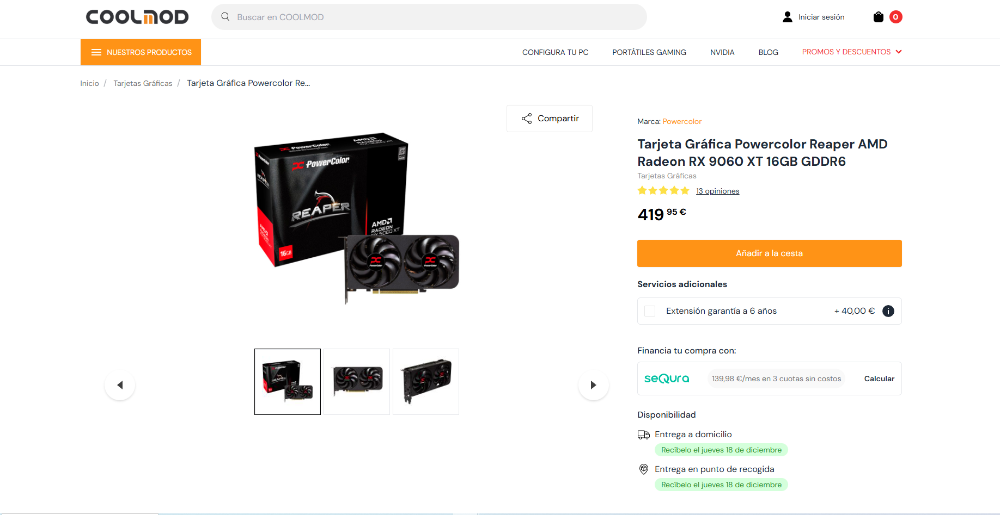
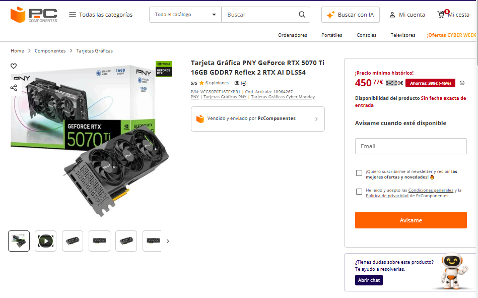
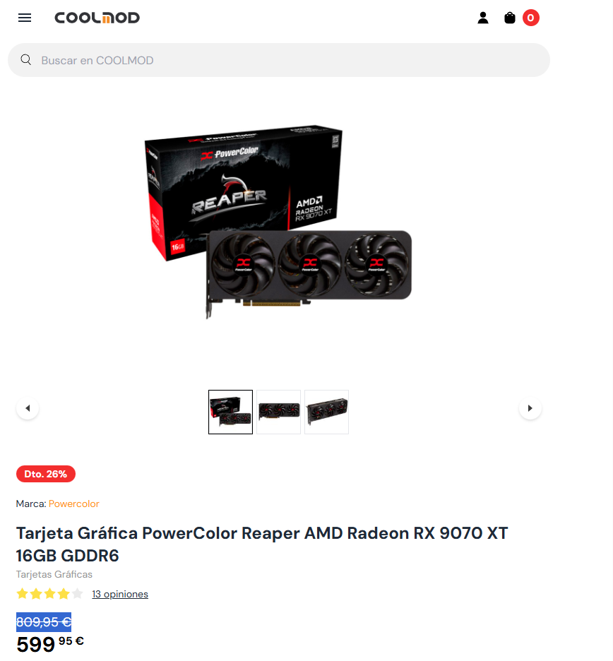

# Parte 3 — GPUs y precios reales (Black Friday 2025)

> Vídeo: [**“Mejores Tarjetas Gráficas Calidad - Precio | TOP GPUs GAMING Black Friday 2025”**](https://www.youtube.com/watch?v=ILOtkTXLUvg)

## 0) Portada

- Alumno/a: _Yllán Cazorla Más_
- Grupo: _ASIR1_
- Fecha: _07/12/2025_

## 1) Introducción (5–10 líneas)

En esta actividad analizaremos el video [Mejores Tarjetas Gráficas Calidad - Precio | TOP GPUs GAMING Black Friday 2025](https://www.youtube.com/watch?v=ILOtkTXLUvg)  y. Resaltaremos los tramos importantes del video.

## 2) Tramos del vídeo y modelos mencionados

### 2.1 Tramo ~350 €

- Minuto inicio–fin: **07:43 – 09:30**
- GPUs citadas (2): **Powercolor AMD Radeon RX 9060 XT (16 GB)**, **Zotac Gaming GeForce RTX 5060 Ti (8GB)**

### 2.2 Tramo 600–800 €

- Minuto inicio–fin: **mm:ss – mm:ss**
- GPUs citadas (2): **RTX 5070 TI**, **RX 9070 XT**

**¿Se repite algún modelo entre tramos?** Explica brevemente.

## 3) Precios reales en tiendas

> Inserta imágenes en `assets/img/30-parte3/` y enlaza con ruta relativa.

### 3.1 GPU del tramo 350 € —  AMD Radeon RX 9060 XT (16 GB)

- Tienda:[Coolmod](https://www.coolmod.com/powercolor-reaper-amd-radeon-rx-9060-xt-16gb-gddr6/)
- Nombre exacto en tienda: Tarjeta Gráfica Powercolor Reaper AMD Radeon RX 9060 XT 16GB GDDR6
- Precio (€):419,95
- URL:[Coolmod](https://www.coolmod.com/powercolor-reaper-amd-radeon-rx-9060-xt-16gb-gddr6/)
- Imagen:

### 3.2 GPU del tramo 350 € —Zotac Gaming GeForce RTX 5060 Ti

- Tienda:[Coolmod](https://www.coolmod.com/zotac-gaming-geforce-rtx-5060-ti-twin-edge-8gb-gddr7-dlss4/)
- Nombre exacto en tienda:Tarjeta Gráfica Zotac Gaming GeForce RTX 5060 Ti TWIN EDGE 8GB GDDR7 DLSS4
- Precio (€): 449,95 € sin rebaja, 369,95 € con rebaja
- URL:[Coolmod](https://www.coolmod.com/zotac-gaming-geforce-rtx-5060-ti-twin-edge-8gb-gddr7-dlss4/)
- Imagen:

### 3.3 GPU del tramo 600–800 € — RTX 5070 TI

- Tienda:[PCcomponentes](https://www.pccomponentes.com/tarjeta-grafica-pny-geforce-rtx-5070-ti-16gb-gddr7-reflex-2-rtx-ai-dlss4?utm_source=790799&utm_medium=afi&utm_campaign=www.youtube.com&sv1=affiliate&sv_campaign_id=790799&awc=20982_1765137275_9d4d0e6624bc68a2ac0483b85c7213b4&utm_term=deeplink&utm_content=)
- Nombre exacto en tienda: Tarjeta Gráfica PNY GeForce RTX 5070 Ti 16GB GDDR7 Reflex 2 RTX AI DLSS4
- Precio (€):450,77€ Rebaja y 849,90€ Sin rebaja
- URL::[PCcomponentes](https://www.pccomponentes.com/tarjeta-grafica-pny-geforce-rtx-5070-ti-16gb-gddr7-reflex-2-rtx-ai-dlss4?utm_source=790799&utm_medium=afi&utm_campaign=www.youtube.com&sv1=affiliate&sv_campaign_id=790799&awc=20982_1765137275_9d4d0e6624bc68a2ac0483b85c7213b4&utm_term=deeplink&utm_content=)
- Imagen:

### 3.4 GPU del tramo 600–800 € — RX 9070 XT

- Tienda:[Coolmod](https://www.coolmod.com/powercolor-reaper-amd-radeon-rx-9070-xt-16gb-gddr6/?_gl=1*168uyd*_up*MQ..*_gs*MQ..&gclid=CjwKCAiAqNSsBhAvEiwAn_tmxelP2Hd6Jc1m3BJ29oDC0orbxSV2WERYk2qBiGi4YBF8LcFTX_yhCBoCbpYQAvD_BwE&click_id=2512071954064760109&iclid=1-22dcac21-f840-3d2d-802d-5d40f821acdc-a93679&utm_source=propelbon)
- Nombre exacto en tienda:Tarjeta Gráfica PowerColor Reaper AMD Radeon RX 9070 XT 16GB GDDR6
- Precio (€):599,95 Rebaja y 809,95€ Sin Rebaja
- URL:[Coolmod](https://www.coolmod.com/powercolor-reaper-amd-radeon-rx-9070-xt-16gb-gddr6/?_gl=1*168uyd*_up*MQ..*_gs*MQ..&gclid=CjwKCAiAqNSsBhAvEiwAn_tmxelP2Hd6Jc1m3BJ29oDC0orbxSV2WERYk2qBiGi4YBF8LcFTX_yhCBoCbpYQAvD_BwE&click_id=2512071954064760109&iclid=1-22dcac21-f840-3d2d-802d-5d40f821acdc-a93679&utm_source=propelbon)
- Imagen:

## 4) Tabla comparativa (precios reales)

| Tramo (vídeo) | GPU (modelo del vídeo) | Tienda                                                                                                                                                                                                                                                                                                                        | Precio (€) | URL                                                                                                                                                                                                                                                                                                                                     | Imagen             |
| ---------------- | ------------------------- | ------------------------------------------------------------------------------------------------------------------------------------------------------------------------------------------------------------------------------------------------------------------------------------------------------------------------------- | ------------: | ----------------------------------------------------------------------------------------------------------------------------------------------------------------------------------------------------------------------------------------------------------------------------------------------------------------------------------------- | -------------------- |
| 350 €         | Radeon RX 9060 XT       | [Coolmod](https://www.coolmod.com/powercolor-reaper-amd-radeon-rx-9060-xt-16gb-gddr6/)                                                                                                                                                                                                                                        |   419,95 € | [Radeon RX 9060 XT](https://www.coolmod.com/powercolor-reaper-amd-radeon-rx-9060-xt-16gb-gddr6/)                                                                                                                                                                                                                                        | *(insertar abajo)* |
| 350 €         | GeForce RTX 5060 Ti     | [Coolmod](https://www.coolmod.com/zotac-gaming-geforce-rtx-5060-ti-twin-edge-8gb-gddr7-dlss4/)                                                                                                                                                                                                                                |   369,95 € | [GeForce RTX 5060 Ti](https://www.coolmod.com/zotac-gaming-geforce-rtx-5060-ti-twin-edge-8gb-gddr7-dlss4/)                                                                                                                                                                                                                              | *(insertar abajo)* |
| 600–800 €    | RTX 5070 TI             | [PCcomponentes](https://www.pccomponentes.com/tarjeta-grafica-pny-geforce-rtx-5070-ti-16gb-gddr7-reflex-2-rtx-ai-dlss4?utm_source=790799&utm_medium=afi&utm_campaign=www.youtube.com&sv1=affiliate&sv_campaign_id=790799&awc=20982_1765137275_9d4d0e6624bc68a2ac0483b85c7213b4&utm_term=deeplink&utm_content=)                |   450,77 € | [RTX 5070 TI](https://www.pccomponentes.com/tarjeta-grafica-pny-geforce-rtx-5070-ti-16gb-gddr7-reflex-2-rtx-ai-dlss4?utm_source=790799&utm_medium=afi&utm_campaign=www.youtube.com&sv1=affiliate&sv_campaign_id=790799&awc=20982_1765137275_9d4d0e6624bc68a2ac0483b85c7213b4&utm_term=deeplink&utm_content=)                            | *(insertar abajo)* |
| 600–800 €    | Radeon RX 9070 XT       | [Coolmod](https://www.coolmod.com/powercolor-reaper-amd-radeon-rx-9070-xt-16gb-gddr6/?_gl=1*168uyd*_up*MQ..*_gs*MQ..&gclid=CjwKCAiAqNSsBhAvEiwAn_tmxelP2Hd6Jc1m3BJ29oDC0orbxSV2WERYk2qBiGi4YBF8LcFTX_yhCBoCbpYQAvD_BwE&click_id=2512071954064760109&iclid=1-22dcac21-f840-3d2d-802d-5d40f821acdc-a93679&utm_source=propelbon) |   599,95 € | [Radeon RX 9070 XT](https://www.coolmod.com/powercolor-reaper-amd-radeon-rx-9070-xt-16gb-gddr6/?_gl=1*168uyd*_up*MQ..*_gs*MQ..&gclid=CjwKCAiAqNSsBhAvEiwAn_tmxelP2Hd6Jc1m3BJ29oDC0orbxSV2WERYk2qBiGi4YBF8LcFTX_yhCBoCbpYQAvD_BwE&click_id=2512071954064760109&iclid=1-22dcac21-f840-3d2d-802d-5d40f821acdc-a93679&utm_source=propelbon) | *(insertar abajo)* |

## 5) Conclusión (5–8 líneas)

- ¿Los precios reales se parecen a lo que sugiere el vídeo?
  No,los precios varian segun si tienen descuento o no ya que depende de la tienda un ejemplo claro es la RTX 5070 que vale un 51% menos por estar rebajada.
- ¿Cuál de las cuatro ofrece mejor **calidad-precio** y por qué?
  La RTX 5070 TI solamente por la rebaja ya que es la mas potente junto a la RX 9070 otra que esta muy bien en precio-calidad es la 5060 TI ya que sin contar la rebaja se queda a un precio muy parecido a la 9060 XT que es la que se podria decir que es su rival en capacidad
- Observaciones finales.
