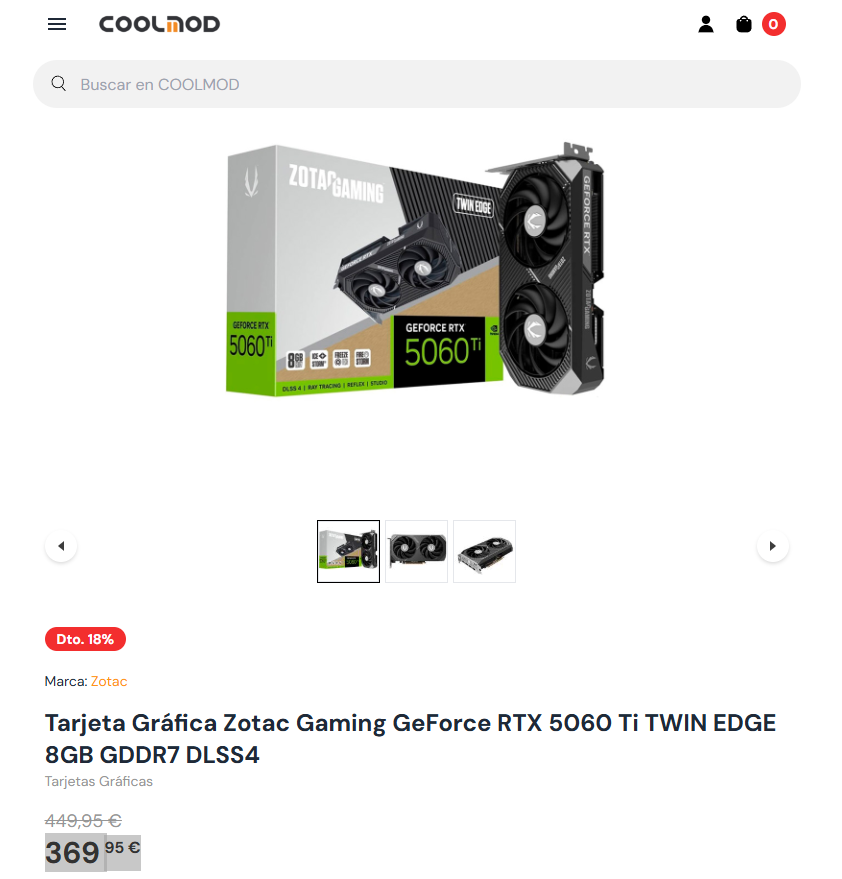

# 00 — Portada 
<a id="P">

- Alumno/a: _Yllán Cazorla Más
- Grupo: _ASIR1_
- Fecha: _07/12/2025
- Reto: **Reto 03 — Elementos internos de un sistema informático (UT2 · RA1)**
  

# 01 — Índice

1. [Portada](#P)
2. [Introducción](#I)
3. [Parte 1 — Fuentes y Refrigeración](#F)
4. [Parte 2 — Componentes y DDR5](#C)
5. [Parte 3 — GPUs Black Friday](#GB)

<a id="I">

# 02 — Introducción
En este reto investigamos **fuentes de alimentación**, **sistemas de refrigeración**, **RAM/CPU** para usos distintos y analizamos **GPUs** comparando las recomendaciones de un vídeo con **precios reales** de tiendas. El resultado final se consolida en un **PDF único**.
<a id="F">
# Parte 1 — Actividades A y B (único archivo)

> Duplica esta plantilla a `tu_parte1.md` y complétala. Las imágenes, si las usas, colócalas en `assets/img/10-parte1/` y enlázalas con rutas relativas.

---

## Actividad A — Investigación de **Fuentes de Alimentación** (9 modelos)

**Instrucciones:**

1. Elige **3 tiendas online españolas/especializadas** (p. ej., PcComponentes, Amazon ES, LDLC ES).
2. En **cada tienda**, selecciona **un modelo ATX**, **uno SFX** y **uno TFX** (total 9).
3. Para cada modelo, recoge: **Marca/Modelo**, **Potencia (W)**, **Certificación 80 PLUS**, **Precio (€)**, **Modularidad**, **PFC (activo/pasivo)**, **Dimensiones (mm)**, **Enlace**.
4. Al final, incluye una **tabla resumen comparativa global**.

### Tienda 1: PCcomponentes

| Tipo | Marca/Modelo    | Potencia (W) | 80 PLUS  | Precio (€) | Modularidad | PFC        | Dimensiones (L×W×H mm) | Enlace                                                                                                                                                |
| ------ | ----------------- | -------------- | ---------- | ------------: | ------------- | ------------ | -------------------------- | ------------------------------------------------------------------------------------------------------------------------------------------------------- |
| ATX  | Corsair/RM750e  | 750W         | Gold     |    139,90€ | Modular     | Active PFC | 150 x 140x 86            | [Fuente ATX](https://www.pccomponentes.com/fuente-alimentacion-corsair-rme-series-rm750e-atx-31-pcie-51-750w-cybenetics-80-plus-gold-modular)         |
| SFX  | Corsair/SF850   | 850W         | Platinum |    181,12€ | Modular     | Active PFC | 125 x 100 x 63.5         | [Fuente SFX](https://www.pccomponentes.com/fuente-alimentacion-corsair-sf850-850w-sfx-80-plus-platinum-modular)                                       |
| TFX  | be quiet!/BN323 | 300W         | Gold     |    130,00€ | No modular  | Active PFC | 175 x 85 x 65            | [Fuente TFX](https://www.pccomponentes.com/fuente-alimentacion-fuente-de-alimentacion-be-quiet-300w-80plus-gold-tfx-power-3-compacta-silenciosa-pcie) |

**Notas/criterios de la tienda 1:**

Pagina sencilla y rapida con asistencia tecnica.

Nota: 10/10

### Tienda 2:LDLC

| Tipo | Marca/Modelo         | Potencia (W) | 80 PLUS      | Precio (€) | Modularidad  | PFC        | Dimensiones (L×W×H mm) | Enlace                                                         |
| ------ | ---------------------- | -------------- | -------------- | ------------: | -------------- | ------------ | -------------------------- | ---------------------------------------------------------------- |
| ATX  | ASUS/90YE00V3-B0NA00 | 1000W        | Platinum III |    399,95€ | Modular      | Active PFC | 190 x 150 x 86 mm        | [Fuente ATX](https://www.ldlc.com/es-es/ficha/PB00677820.html) |
| SFX  | be quiet!/BN321      | 450W         | Bronce       |     76,95€ | No modulares | Active PFC | 100 x 125 x 63,5         | [Fuente SFX](https://www.ldlc.com/es-es/ficha/PB00430602.html) |
| TFX  | be quiet! BN323      | 300W         | GOLD         |     76,95€ | No modulares | Active PFC | 175 x 85 x 65            | [Fuente TFX](https://www.ldlc.com/es-es/ficha/PB00430598.html) |

**Notas/criterios de la tienda 2:**

Sencilla y rapida pero falta un catalogo mas variado

Nota:6/10

### Tienda 3:Depau

| Tipo | Marca/Modelo       | Potencia (W) | 80 PLUS            | Precio (€) | Modularidad | PFC        | Dimensiones (L×W×H mm) | Enlace                                                                                   |
| ------ | -------------------- | -------------- | -------------------- | ------------: | ------------- | ------------ | -------------------------- | ------------------------------------------------------------------------------------------ |
| ATX  | HIDITEC/ GDX750 V2 | 750W         | GOLD               |    100,42€ | Modular     | Active PFC | 160 x 150 x 86           | [Fuente ATX](https://www.depau.es/fuente-de-alimentacion-hiditec-gdx750-v2-0117454)      |
| SFX  | AISENS/ASPC-500SFX | 500W         | Sin especificacion |     25,00€ | No modular  | No tiene   | 100 x 125 x 63           | [Fuente SFX](https://www.depau.es/fuente-de-alimentacion-sfx-aisens-aspc-500sfx-0130253) |
| TFX  | TOOQ/TQEP-TFX500S  | 500W         | Sin especificacion |     20,00€ | No modular  | no tiene   | 175 x 85 x 65            | [Fuente TFX](https://www.depau.es/fuente-de-alimentacion-tfx-tooq-tqep-tfx500s-0093187)  |

**Notas/criterios de la tienda 3:**

Pagina sencilla

Falta mas variedad en el catalogo

Inconveniente: No puedes ver los precios sin estar registrado por lo cual los precios los e sacado de otras paginas

Nota: 3/10 No la recomendaria

#### Tabla **resumen comparativa** (global, 9 modelos)

| **Tienda**        | **Tipo** | **Marca/Modelo**     | **Potencia (W)** | **80 PLUS**        | **Precio (€)** | **Modularidad** | **PFC**    | **Dimensiones (mm)** | **Observaciones**                                                                                                           |
| ------------------- | ---------- | ---------------------- | ------------------ | -------------------- | ----------------- | ----------------- | ------------ | ---------------------- | ----------------------------------------------------------------------------------------------------------------------------- |
| **PCComponentes** | ATX      | Corsair/RM750e       | 750W             | Gold               | 139,90€        | Modular         | Active PFC | 150 x 140 x 86       | Modelo de menos potencia a cambio de menos precio cuenta con hasta 5 modelos diferentes                                     |
| **PCComponentes** | SFX      | Corsair/SF850        | 850W             | Platinum           | 181,12€        | Modular         | Active PFC | 125 x 100 x 63.5     | Buena fuente cuenta con otros modelos con menos potenciia                                                                   |
| **PCComponentes** | TFX      | be quiet!/BN323      | 300W             | Gold               | 130,00€        | No modular      | Active PFC | 175 x 85 x 65        | Decente ni muy buena ni muy mala buena fuente                                                                               |
| ---               | ---      | ---                  | ---              | ---                | ---             | ---             | ---        | ---                  | ---                                                                                                                         |
| **LDLC**          | ATX      | ASUS/90YE00V3-B0NA00 | 1000W            | Platinum III       | 399,95€        | Modular         | Active PFC | 190 x 150 x 86       | Poco stock envio que tarda hasta 3 meses                                                                                    |
| **LDLC**          | SFX      | be quiet!/BN321      | 450W             | Bronce             | 76,95€         | No modulares    | Active PFC | 100 x 125 x 63,5     | No recomiendo Usar fuentes de alimentacion por debajo de certificado oro                                                    |
| **LDLC**          | TFX      | be quiet! BN323      | 300W             | Gold               | 76,95€         | No modulares    | Active PFC | 175 x 85 x 65        | Decente ni muy buena ni muy mala buena fuente                                                                               |
| ---               | ---      | ---                  | ---              | ---                | ---             | ---             | ---        | ---                  | ---                                                                                                                         |
| **Depau**         | ATX      | HIDITEC/ GDX750 V2   | 750W             | GOLD               | 100,42€        | Modular         | Active PFC | 160 x 150 x 86       | Decente ni muy buena ni muy mala buena fuente                                                                               |
| **Depau**         | SFX      | AISENS/ASPC-500SFX   | 500W             | Sin especificacion | 25,00€         | No modular      | No tiene   | 100 x 125 x 63       | No recomiendo comprar una fuente a la que le falta informacion pero lo mas importante que le falta la certificacion 80 PLUS |
| **Depau**         | TFX      | TOOQ/TQEP-TFX500S    | 500W             | Sin especificacion | 20,00€         | No modular      | no tiene   | 175 x 85 x 65        | No recomiendo comprar en Depau por falta de informacion                                                                     |

---

## Actividad B — **Refrigeración para la MISMA CPU** (Líquida vs Pasiva)

**Instrucciones:**

1. Elige una **CPU concreta** (ej.: Intel Core i9-13900, AMD Ryzen 9 7950X…). Indícala abajo.
2. Selecciona **una refrigeración líquida AIO** y **una refrigeración pasiva** **compatibles** con esa CPU. Incluye **URLs** oficiales o de tienda.
3. Compara **precio, eficiencia térmica (TDP soportado/temperaturas), ruido, dimensiones, compatibilidad de socket, mantenimiento, garantía**…
4. **Concluye** con recomendaciones por perfil (**gamer**, **diseño/pro**, **usuario estándar**) y **calidad-precio**.

**CPU elegida:** [Procesador AMD Ryzen 7 5800X 3.8GHz](https://www.pccomponentes.com/amd-ryzen-7-5800x-38ghz)

### Modelos evaluados

| Tipo           | Marca/Modelo                            | Precio (€) | TDP soportado / Rendimiento térmico    | Ruido (dBA) | Dimensiones (mm)          | Sockets                                                                                                                                                                                                                                                                                                      | Mantenimiento     | Garantía                                       | Enlace                                                                                                                                                                                                                                                                                         |
| ---------------- | ----------------------------------------- | ------------: | ----------------------------------------- | ------------- | --------------------------- | -------------------------------------------------------------------------------------------------------------------------------------------------------------------------------------------------------------------------------------------------------------------------------------------------------------- | ------------------- | ------------------------------------------------- | ------------------------------------------------------------------------------------------------------------------------------------------------------------------------------------------------------------------------------------------------------------------------------------------------ |
| Líquida (AIO) | ARCTIC Liquid Freezer III Pro 360 A-RGB |    109,72€ | Alto Rendimiento / Disipación superior | Silencioso  | ‎39,88 x 11,94 x 7,37 cm | Intel: LGA1851, LGA1700; AMD: AM5, AM4                                                                                                                                                                                                                                                                       | Sin mantenimiento | Garantia de 24h garantia de 1 año por separado | [AIO](https://www.pccomponentes.com/refrigeracion-liquida-arctic-liquid-freezer-iii-pro-360-a-rgb-3x12cm-blanco-multicolor-pwm)                                                                                                                                                                |
| Pasiva         | Noctua NH-P1                            |    152,89€ | Adecuado al procesador                  | sin ruido   | 158 x 154 x 152 mm        | LGA 1150 (Zócalo H3), LGA 1151 (Zócalo H4), LGA 1155 (Socket H2), LGA 1156 (Socket H), LGA 1200 (Socket H5), LGA 2011 (Socket R), LGA 2011-v3 (Socket R), LGA 2066, Socket AM2, Socket AM3, Socket AM3, Socket AM3+, Zócalo AM4, Socket FM1, Socket FM2, Socket FM2+ hardware de montaje LGA1700 incluido | Limpieza de polvo | 6 AÑOS                                         | [PASIVA](http://pccomponentes.com/noctua-nh-p1-disipador-pasivo-cpu?utm_source=369493&utm_medium=afi&utm_campaign=www.google.com&sv1=affiliate&sv_campaign_id=369493&awc=20982_1765123362_fbbd502f2d0cd2db5f16e56ae21271b7&utm_term=deeplink&utm_content=ea8c5c2c-983d-475b-bb4a-24f25e391d05) |

### Análisis y elección por perfil

- **Gamer:** Ventilacion liquida el procesador tendra problemas de calentamiento si usamos pasiva al jugar juegos de altos recursos.
- **Profesional de diseño/simulación:** Recomiendo refrigeracion liquida porque en entornos de diseño se necesita gran potencia y refrigeracion.
- **Usuario estándar/ofimática:** Para ofimatica recomiendo refrigeracion pasiva porque de normal no se necesita tanta potencia como en los 2 anteriores casos.

### Conclusión general

Despues de un tiempo de analisis e llegado a la conclusion de que lo mejor seria comprar la refrigeracion  liquida por precio sin embargo si  el cliente desea algo totalmente silencioso y no es para gaming o diseño recomendaria la pasiva.
<a id="C">
# Parte 2 — Componentes y DDR5 (archivo único)

## 1) Búsqueda de componentes

Para cada uno: **marca/modelo**, **características**, **precio**, **URL**, **captura**, **justificación**.

### RAM oficina

- Marca/Modelo:
- Capacidad/Velocidad/Tipo:16GB (2x8GB) / 3200MHz / DDR4 /
- Precio:105,93€
- URL:[PCcomponentes](https://www.pccomponentes.com/corsair-vengeance-lpx-ddr4-3200-pc4-25600-16gb-2x8gb-cl16-negro)
- Captura:
- Justificación:Maldita IA esta carisima la RAM,buena velocidad y capacidad precio alto pero ahora mismo es un precio normal comparando los precios actuales. 16Gb es el nuevo estandar

### RAM gaming

- Marca/Modelo:Memoria RAM Corsair Vengeance RGB DDR5
- Capacidad/Velocidad/Tipo:32GB (2x16GB) / 6000MHz / DDR5
- Precio:479,95€
- URL::[PCcomponentes](https://www.pccomponentes.com/corsair-vengeance-rgb-ddr5-6000mhz-32-gb-2x16gb-cl36-memoria-dual-amd-expo-e-intel-xmp)
- Captura:
- Justificación:En gaming se necesita ir a la maxima potencia posible y ahora con los avances en videojuegos el estandar es 16GB pero se esta empezando a necesitar hasta  32GB no dudo que dentro de poco sea el nuevo estandar en gaming . Y con luces para mas personalizacion

### CPU oficina

- Marca/Modelo:Intel Core i3-12100
- Núcleos/Hilos/Frecuencia:4 Núcleos / 8 Hilos / 3.3 GHz
- TDP/Gráfica integrada (si aplica):60W / gradicos integrados: Intel® UHD Graphics 730
- Precio:154,90€
- URL:[PCcomponentes](https://www.pccomponentes.com/intel-core-i3-12100-33-ghz)
- Captura:
- Justificación:Procesador intel con 4 nucleos potencia suficiente para aplicaciones de ofimatica y  tambien tiene graficos integrados

### CPU gaming

- Marca/Modelo:AMD Ryzen™ 7 8700G Processor
- Núcleos/Hilos/Frecuencia:8 Núcleos / 16 Hilos / 4.2 GHz
- TDP:65W añade graficos: AMD Radeon 780M
- Precio:288.00€
- URL:[AMD](https://shop-eu-en.amd.com/amd-ryzen-7-8700G-processor/)
- Captura:
- Justificación:No es un procesador normal es un procesador con graficos integrados(APU) tiene una potencia alta ademas añade el no tener que usar una tarjeta grafica lo cual baja el precio y añade mas tiempo antes de que se quede obsoleta ya que te permite añadirle una grafica para aumentar su potencia.

## 2) Tabla comparativa RAM (DDR4 vs DDR5)

| Atributo       | DDR4                                | DDR5            |
| ---------------- | ------------------------------------- | ----------------- |
| Velocidad      | 3200                                | 6400            |
| Consumo        | 1.2V                                | 1.1             |
| Precio         | 80€                                | 200€           |
| Compatibilidad | placas antiguas y modernas/antiguas | Placas modernas |

No añado las velocidades al hacer overclocking solo uso estandares para el precio e buscado lo mas barato y e hecho una media  que de velocidad tenga estandar y llegue a 16GB.

## 3) Investigación DDR5- Ventajas respecto a DDR4:

* Usos principales donde más se nota:

Compresión/Descompresión de archivos, dición de Vídeo y Renderizado, Gaming a altos FPS

* Ejemplo de dispositivo/situación especialmente ventajosa:
  Son especialmente usadas para ordenadores gaming y streamers.
  La mayor situacion ventajosa es para el uso de IA. Necesitan demasiada RAM lo cual a provocado que los precios suban por que las empresas se han interesado en su uso y para eso necesitan toda RAM a su alcance.

<a id="GB">

# Parte 3 — GPUs y precios reales (Black Friday 2025)

> Vídeo: [**“Mejores Tarjetas Gráficas Calidad - Precio | TOP GPUs GAMING Black Friday 2025”**](https://www.youtube.com/watch?v=ILOtkTXLUvg)

## 0) Portada

- Alumno/a: _Yllán Cazorla Más_
- Grupo: _ASIR1_
- Fecha: _07/12/2025_

## 1) Introducción (5–10 líneas)

En esta actividad analizaremos el video [Mejores Tarjetas Gráficas Calidad - Precio | TOP GPUs GAMING Black Friday 2025](https://www.youtube.com/watch?v=ILOtkTXLUvg)  y. Resaltaremos los tramos importantes del video.

## 2) Tramos del vídeo y modelos mencionados

### 2.1 Tramo ~350 €

- Minuto inicio–fin: **07:43 – 09:30**
- GPUs citadas (2): **Powercolor AMD Radeon RX 9060 XT (16 GB)**, **Zotac Gaming GeForce RTX 5060 Ti (8GB)**

### 2.2 Tramo 600–800 €

- Minuto inicio–fin: **mm:ss – mm:ss**
- GPUs citadas (2): **RTX 5070 TI**, **RX 9070 XT**

**¿Se repite algún modelo entre tramos?** Explica brevemente.

## 3) Precios reales en tiendas

> Inserta imágenes en `assets/img/30-parte3/` y enlaza con ruta relativa.

### 3.1 GPU del tramo 350 € —  AMD Radeon RX 9060 XT (16 GB)

- Tienda:[Coolmod](https://www.coolmod.com/powercolor-reaper-amd-radeon-rx-9060-xt-16gb-gddr6/)
- Nombre exacto en tienda: Tarjeta Gráfica Powercolor Reaper AMD Radeon RX 9060 XT 16GB GDDR6
- Precio (€):419,95
- URL:[Coolmod](https://www.coolmod.com/powercolor-reaper-amd-radeon-rx-9060-xt-16gb-gddr6/)
- Imagen:

### 3.2 GPU del tramo 350 € —Zotac Gaming GeForce RTX 5060 Ti

- Tienda:[Coolmod](https://www.coolmod.com/zotac-gaming-geforce-rtx-5060-ti-twin-edge-8gb-gddr7-dlss4/)
- Nombre exacto en tienda:Tarjeta Gráfica Zotac Gaming GeForce RTX 5060 Ti TWIN EDGE 8GB GDDR7 DLSS4
- Precio (€): 449,95 € sin rebaja, 369,95 € con rebaja
- URL:[Coolmod](https://www.coolmod.com/zotac-gaming-geforce-rtx-5060-ti-twin-edge-8gb-gddr7-dlss4/)
- Imagen:

### 3.3 GPU del tramo 600–800 € — RTX 5070 TI

- Tienda:[PCcomponentes](https://www.pccomponentes.com/tarjeta-grafica-pny-geforce-rtx-5070-ti-16gb-gddr7-reflex-2-rtx-ai-dlss4?utm_source=790799&utm_medium=afi&utm_campaign=www.youtube.com&sv1=affiliate&sv_campaign_id=790799&awc=20982_1765137275_9d4d0e6624bc68a2ac0483b85c7213b4&utm_term=deeplink&utm_content=)
- Nombre exacto en tienda: Tarjeta Gráfica PNY GeForce RTX 5070 Ti 16GB GDDR7 Reflex 2 RTX AI DLSS4
- Precio (€):450,77€ Rebaja y 849,90€ Sin rebaja
- URL::[PCcomponentes](https://www.pccomponentes.com/tarjeta-grafica-pny-geforce-rtx-5070-ti-16gb-gddr7-reflex-2-rtx-ai-dlss4?utm_source=790799&utm_medium=afi&utm_campaign=www.youtube.com&sv1=affiliate&sv_campaign_id=790799&awc=20982_1765137275_9d4d0e6624bc68a2ac0483b85c7213b4&utm_term=deeplink&utm_content=)
- Imagen:

### 3.4 GPU del tramo 600–800 € — RX 9070 XT

- Tienda:[Coolmod](https://www.coolmod.com/powercolor-reaper-amd-radeon-rx-9070-xt-16gb-gddr6/?_gl=1*168uyd*_up*MQ..*_gs*MQ..&gclid=CjwKCAiAqNSsBhAvEiwAn_tmxelP2Hd6Jc1m3BJ29oDC0orbxSV2WERYk2qBiGi4YBF8LcFTX_yhCBoCbpYQAvD_BwE&click_id=2512071954064760109&iclid=1-22dcac21-f840-3d2d-802d-5d40f821acdc-a93679&utm_source=propelbon)
- Nombre exacto en tienda:Tarjeta Gráfica PowerColor Reaper AMD Radeon RX 9070 XT 16GB GDDR6
- Precio (€):599,95 Rebaja y 809,95€ Sin Rebaja
- URL:[Coolmod](https://www.coolmod.com/powercolor-reaper-amd-radeon-rx-9070-xt-16gb-gddr6/?_gl=1*168uyd*_up*MQ..*_gs*MQ..&gclid=CjwKCAiAqNSsBhAvEiwAn_tmxelP2Hd6Jc1m3BJ29oDC0orbxSV2WERYk2qBiGi4YBF8LcFTX_yhCBoCbpYQAvD_BwE&click_id=2512071954064760109&iclid=1-22dcac21-f840-3d2d-802d-5d40f821acdc-a93679&utm_source=propelbon)
- Imagen:

## 4) Tabla comparativa (precios reales)

| Tramo (vídeo) | GPU (modelo del vídeo) | Tienda                                                                                                                                                                                                                                                                                                                        | Precio (€) | URL                                                                                                                                                                                                                                                                                                                                     | Imagen             |
| ---------------- | ------------------------- | ------------------------------------------------------------------------------------------------------------------------------------------------------------------------------------------------------------------------------------------------------------------------------------------------------------------------------- | ------------: | ----------------------------------------------------------------------------------------------------------------------------------------------------------------------------------------------------------------------------------------------------------------------------------------------------------------------------------------- | -------------------- |
| 350 €         | Radeon RX 9060 XT       | [Coolmod](https://www.coolmod.com/powercolor-reaper-amd-radeon-rx-9060-xt-16gb-gddr6/)                                                                                                                                                                                                                                        |   419,95 € | [Radeon RX 9060 XT](https://www.coolmod.com/powercolor-reaper-amd-radeon-rx-9060-xt-16gb-gddr6/)                                                                                                                                                                                                                                        | *(insertar abajo)* |
| 350 €         | GeForce RTX 5060 Ti     | [Coolmod](https://www.coolmod.com/zotac-gaming-geforce-rtx-5060-ti-twin-edge-8gb-gddr7-dlss4/)                                                                                                                                                                                                                                |   369,95 € | [GeForce RTX 5060 Ti](https://www.coolmod.com/zotac-gaming-geforce-rtx-5060-ti-twin-edge-8gb-gddr7-dlss4/)                                                                                                                                                                                                                              | *(insertar abajo)* |
| 600–800 €    | RTX 5070 TI             | [PCcomponentes](https://www.pccomponentes.com/tarjeta-grafica-pny-geforce-rtx-5070-ti-16gb-gddr7-reflex-2-rtx-ai-dlss4?utm_source=790799&utm_medium=afi&utm_campaign=www.youtube.com&sv1=affiliate&sv_campaign_id=790799&awc=20982_1765137275_9d4d0e6624bc68a2ac0483b85c7213b4&utm_term=deeplink&utm_content=)                |   450,77 € | [RTX 5070 TI](https://www.pccomponentes.com/tarjeta-grafica-pny-geforce-rtx-5070-ti-16gb-gddr7-reflex-2-rtx-ai-dlss4?utm_source=790799&utm_medium=afi&utm_campaign=www.youtube.com&sv1=affiliate&sv_campaign_id=790799&awc=20982_1765137275_9d4d0e6624bc68a2ac0483b85c7213b4&utm_term=deeplink&utm_content=)                            | *(insertar abajo)* |
| 600–800 €    | Radeon RX 9070 XT       | [Coolmod](https://www.coolmod.com/powercolor-reaper-amd-radeon-rx-9070-xt-16gb-gddr6/?_gl=1*168uyd*_up*MQ..*_gs*MQ..&gclid=CjwKCAiAqNSsBhAvEiwAn_tmxelP2Hd6Jc1m3BJ29oDC0orbxSV2WERYk2qBiGi4YBF8LcFTX_yhCBoCbpYQAvD_BwE&click_id=2512071954064760109&iclid=1-22dcac21-f840-3d2d-802d-5d40f821acdc-a93679&utm_source=propelbon) |   599,95 € | [Radeon RX 9070 XT](https://www.coolmod.com/powercolor-reaper-amd-radeon-rx-9070-xt-16gb-gddr6/?_gl=1*168uyd*_up*MQ..*_gs*MQ..&gclid=CjwKCAiAqNSsBhAvEiwAn_tmxelP2Hd6Jc1m3BJ29oDC0orbxSV2WERYk2qBiGi4YBF8LcFTX_yhCBoCbpYQAvD_BwE&click_id=2512071954064760109&iclid=1-22dcac21-f840-3d2d-802d-5d40f821acdc-a93679&utm_source=propelbon) | *(insertar abajo)* |

## 5) Conclusión (5–8 líneas)

- ¿Los precios reales se parecen a lo que sugiere el vídeo?
  No,los precios varian segun si tienen descuento o no ya que depende de la tienda un ejemplo claro es la RTX 5070 que vale un 51% menos por estar rebajada.
- ¿Cuál de las cuatro ofrece mejor **calidad-precio** y por qué?
  La RTX 5070 TI solamente por la rebaja ya que es la mas potente junto a la RX 9070 otra que esta muy bien en precio-calidad es la 5060 TI ya que sin contar la rebaja se queda a un precio muy parecido a la 9060 XT que es la que se podria decir que es su rival en capacidad
- Observaciones finales.
